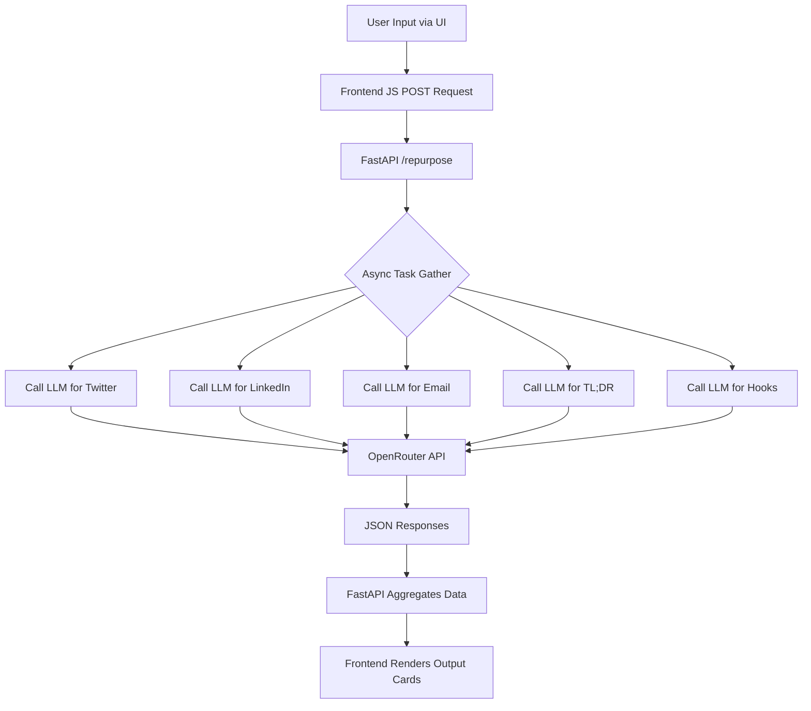

<p align="center">
  <h1 align="center">✦ Repurpose AI</h1>
</p>

<p align="center">
  Paste any content — get 5 platform-ready formats in seconds simultaneously!
</p>

<p align="center">
  
  
  
  
  <br/>
  
</p>

---

## 📑 Table of Contents

- [📖 About The Project](#-about-the-project)
- [✨ Features](#-features)
- [🏗️ Architecture & Workflow](#️-architecture--workflow)
- [🚀 Getting Started](#-getting-started)
- [🔌 API Reference](#-api-reference)
- [📁 Project Structure](#-project-structure)
- [🗺️ Roadmap](#️-roadmap)
- [🤝 Contributing](#-contributing)
- [👤 Author & Acknowledgements](#-author--acknowledgements)

---

## 📖 About The Project

Content creation is incredibly time-consuming. You write a fantastic long-form blog post, but then you have to manually rewrite it for a Twitter thread, a LinkedIn post, and your weekly email newsletter. **Repurpose AI** automates this entire process. 

This project is a blazing-fast FastAPI backend coupled with a sleek, vanilla HTML/JS frontend that leverages the OpenRouter LLM API. By pasting a single piece of content, the system makes asynchronous, parallel requests to a large language model (Llama 3 8B Instruct), instantly generating five distinct, platform-optimized formats at once. It saves creators, developers, and businesses hours of manual labor.

### 🛠️ Built With

<p align="center">
  
  
  
  
  
  
</p>

---

## ✨ Features

- ⚡ **Parallel Generation**: Generates all 5 output formats simultaneously using Python's `asyncio`.
- 🐦 **Twitter Threads**: Converts content into punchy, scroll-stopping, numbered Twitter threads.
- 💼 **LinkedIn Posts**: Formats content into professional, engaging LinkedIn posts with bullet points.
- 📧 **Email Newsletters**: Drafts an email body with subject line suggestions and actionable tips.
- ⚡ **Summary(TL;DR)**: Condenses massive text blocks into three easily digestible bullet points.
- 🎣 **Headline Hooks**: Creates 5 curious and bold headline options for blog titles or ad copy.
- 🎨 **Modern UI**: Features a dark-themed, glassmorphism-inspired beautiful interface.
- 📋 **One-Click Copy**: Instantly copy your generated outputs to the clipboard with visual feedback.

---

## 🏗️ Architecture & Workflow

### A) Architecture Diagram

```text
[ Vanilla HTML/JS Frontend ]
          │    ▲
          │    │
 POST Req │    │ JSON Response (5 formats)
          ▼    │
   [ FastAPI Backend ]
          │    ▲
          │    │
  Asyncio │    │ LLM Text Output
 Parallel │    │
          ▼    │
[ OpenRouter API (Llama 3) ]
```

### B) Workflow

1. 🖊️ User pastes long-form text into the UI text area.
2. ✅ User toggles the desired output formats (Twitter, LinkedIn, Email, TL;DR, Hooks).
3. 🖱️ User clicks the "Repurpose Content" button.
4. 📡 Frontend JavaScript sends a `POST` request to the `/repurpose` endpoint with the content and format array.
5. ⚡ FastAPI receives the request and creates an asynchronous task for each requested format.
6. 🧠 Backend makes parallel HTTP requests to the OpenRouter LLM API with specialized system prompts.
7. 📥 The LLM API returns the distinct rewritten texts.
8. 🔄 Backend gathers all responses and structures them into a single JSON response.
9. 🚀 Frontend updates the UI DOM to display the newly generated content cards.

### C) System Flowchart



---

## 🚀 Getting Started

### Prerequisites

- Python 3.9+ installed on your system
- Git
- An OpenRouter API key (Free tier works!)

### Installation

1. **Clone the repository**
```bash
git clone https://github.com/yourusername/repurpose-ai.git
cd repurpose-ai
```

2. **Create and activate a virtual environment**
```bash
# Windows
python -m venv venv
.\venv\Scripts\Activate.ps1

# macOS/Linux
python -m venv venv
source venv/bin/activate
```

3. **Install dependencies**
```bash
pip install -r requirements.txt
```

4. **Set up Environment Variables**
Create a `.env` file in the root directory and add your key:
```bash
echo OPENROUTER_API_KEY=your_api_key_here > .env
```

5. **Run the Server**
```bash
uvicorn main:app --reload --host 0.0.0.0 --port 8000
```
Open `http://localhost:8000` in your browser.

### Environment Variables

| Variable | Description | Example Value | Required |
|----------|-------------|---------------|----------|
| `OPENROUTER_API_KEY` | API key to access OpenRouter LLM models | `sk-or-v1-...` | Yes |

---

## 🔌 API Reference

| Method | Endpoint | Description | Request Body | Response |
|--------|----------|-------------|--------------|----------|
| `GET` | `/` | Serves the HTML frontend application. | None | `index.html` file |
| `GET` | `/health` | API health check. | None | `{"status": "ok", "model": "...", "key_set": true}` |
| `POST` | `/repurpose` | Generates multiple formats for the given content. | `{"content": "string", "formats": ["twitter", "tldr"]}` | JSON with generated outputs and metadata |

**Example Repurpose Request:**
```bash
curl -X POST "http://localhost:8000/repurpose" \
     -H "Content-Type: application/json" \
     -d '{"content": "A very long text about AI...", "formats": ["twitter", "linkedin"]}'
```

---

## 📁 Project Structure

```text
repurpose-ai/
├── main.py           # FastAPI app entry point & async LLM logic
├── index.html        # Vanilla HTML/JS frontend UI
├── requirements.txt  # Python package dependencies
├── .env              # Environment variables (ignored by git)
└── venv/             # Python virtual environment folder
```

---

## 🗺️ Roadmap

- [x] Initial FastAPI Backend Setup
- [x] Vanilla HTML Frontend with Dark Mode
- [x] Integrate OpenRouter API
- [x] Parallel Asynchronous Request Handling
- [ ] Add PDF and Word document upload support
- [ ] Allow users to define custom prompts for new formats
- [ ] Implement user authentication and history saving
- [ ] Deploy to cloud platform (Render/Vercel/Heroku)

---

## 🤝 Contributing

Contributions are what make the open source community such an amazing place to learn, inspire, and create. Any contributions you make are **greatly appreciated**.

1. **Fork the Project**
2. **Create your Feature Branch**
```bash
git checkout -b feature/AmazingFeature
```
3. **Commit your Changes**
```bash
git commit -m 'Add some AmazingFeature'
```
4. **Push to the Branch**
```bash
git push origin feature/AmazingFeature
```
5. **Open a Pull Request**

---

## 👤 Author & Acknowledgements

<p align="center">
  
</p>

**Acknowledgements:**
- [FastAPI](https://fastapi.tiangolo.com/) for the incredibly fast backend framework.
- [OpenRouter](https://openrouter.ai/) for accessible and unified LLM endpoints.
- [Shields.io](https://shields.io) for the awesome README badges.
